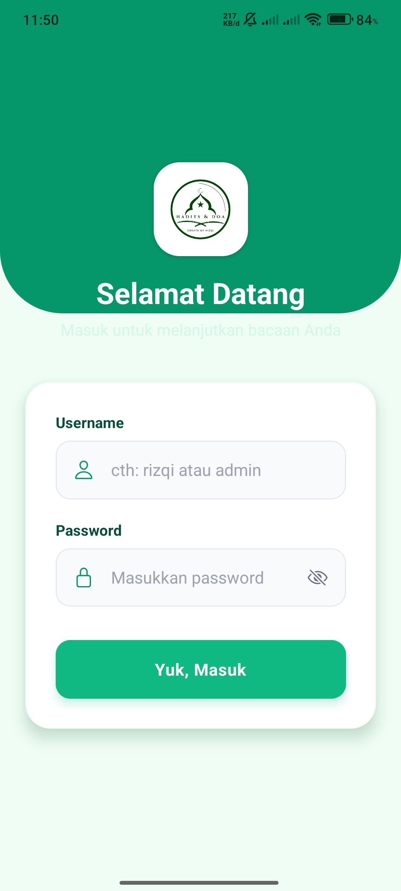
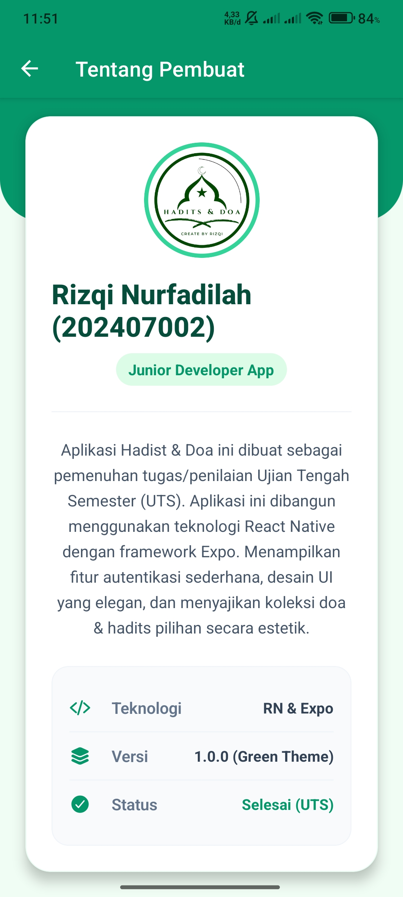

# 📖 Aplikasi Hadist & Doa

Aplikasi **Hadist & Doa** adalah aplikasi mobile interaktif bernuansa Islami yang dibangun menggunakan **React Native** dan **Expo Router**. Aplikasi ini diciptakan khusus sebagai project pemenuhan tugas Ujian Tengah Semester (UTS) dengan mengedepankan fungsionalitas dan User Interface (UI) yang memanjakan mata melalui balutan *Emerald Green Theme*.

Melalui aplikasi ini, pengguna dapat membaca serta meresapi makna dari kumpulan doa harian dan hadits pilihan, lengkap dengan teks Arab, tulisan Latin beraksen, serta terjemahannya dalam Bahasa Indonesia.

## ✨ Fitur Utama

- **Sistem Autentikasi**: Halaman Login sederhana bergaya *premium modern* dengan validasi statis.
- **Desain Estetik**: Antarmuka dengan overlay Hijau Gelap (*Emerald Dark Theme*) dipadukan efek transparan (*Glassmorphism*) dan navigasi menu *card* yang sangat rapi.
- **Kumpulan Doa Harian**: Doa sebelum & bangun tidur, serta doa sebelum & sesudah makan.
- **Kumpulan Hadits Pilihan**: Hadits mendasar tentang Niat, Menuntut Ilmu, Kebersihan, dan Kasih Sayang.
- **Transisi Super Mulus**: Animasi *progress bar* saat awal mula aplikasi di buka dan navigasi sehalus sutra (*silky smooth*) berkat dukungan performa teknologi *Expo Router*.

---

## 📸 Tangkapan Layar Aplikasi (Screenshots)

Berikut sekilas pandang dari detail keindahan antarmuka **Aplikasi Hadist & Doa**:

### 1. Pembukaan & Autentikasi (Splash Screen & Login)
| Splash Screen | Halaman Login |
|:---:|:---:|
|  |  |

### 2. Dasbor Keikutsertaan & Profil (Home & Tentang)
| Menu Utama (Beranda) | Informasi Pembuat |
|:---:|:---:|
|  |  |

### 3. Daftar Utama Bacaan (Kumpulan List Menu)
| Navigasi Doa | Navigasi Hadits |
|:---:|:---:|
|  |  |

### 4. Mode Kedamaian Membaca (Detail Doa & Hadits)
*Halaman detail disajikan dengan latar gambar dan mode overlay hijau tua minimalis untuk menambah kekhusyukan pengguna saat membacanya.*
| Contoh Teks Doa Harian | Contoh Teks Hadits Pilihan |
|:---:|:---:|
|  |  |

---

## 🚀 Cara Menjalankan Secara Lokal

1. Pastikan Anda telah terkomputerisasi dengan alat  **Node.js** dan **npm / yarn**.
2. _Clone repository_ ini ke PC/Laptop:
   ```bash
   git clone https://github.com/Rizqi2024/Doa_Hadits.git
   ```
3. Masuk ke direktori projek baru Anda:
   ```bash
   cd Doa_Hadits
   ```
4. Pasang library/dependencies terkait:
   ```bash
   npm install
   ```
5. Siapkan server pembantu Expo:
   ```bash
   npx expo start
   ```
6. Unduh aplikasi **Expo Go** pada ponsel bersistem operasi _iOS_ atau _Android_ Anda, lalu pindai _QR Code_ yang muncul di layar terminal.

---

## 🔐 Akun Login (Default Credentials)

Untuk masuk ke dalam aplikasi, Anda dapat menggunakan salah satu dari akun berikut:

- **Pengguna / Tamu**
  - Username: `rizqi`
  - Password: `rizqi123`

- **Administrator**
  - Username: `admin`
  - Password: `admin123`

---
## 🛠 Teknologi Pendukung
- **React Native** - _Framework_ dasar pembangunan aplikasi mobile
- **Expo SDK** - Mempermudah kompilasi dan _hot-reloading_ komponen  
- **Expo Router** - Pengaturan aliran *Route* layaknya navigasi modern Next.js
- **Ionicons (@expo/vector-icons)** - Desain standar sistem Ikon Premium 

---
💡 **Dikembangkan oleh:** Rizqi Nurfadilah (202407002) - *Junior Developer App*
